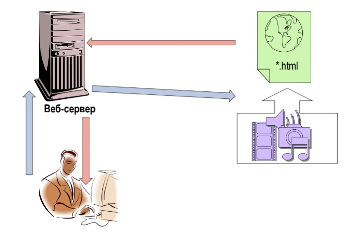
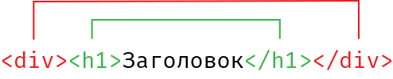
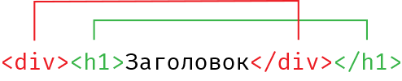
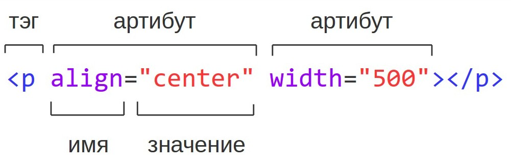

Как работает
--------------------


Структура документа
--------------------
```html
<html>
    <head>
        Служебная информация
    </head>
    <body>
        Видимый контент
    </body>
</html>
```

### Заголовок документа
```html
<head>
    <title>Заголовок документа</title>
</head>
```

### Стандарт документа
`<!DOCTYPE html>`

### Кодировка страницы
`<meta charset="utf-8">`

### Комментарии
```html
<head>
    <!--Это заголовок документа-->
    <title>Заголовок документа</title>
</head>
<body>
    <!--Здесь будетсодержимое документа -->
</body>
```

Теги
--------------------

Заголовки
```html
<h1>Заголовок 1-го уровня</h1>
<h2>Заголовок 2-го уровня</h2>
<h3>Заголовок 3-го уровня</h3>
<h4>Заголовок 4-го уровня</h4>
<h5>Заголовок 5-го уровня</h5>
<h6>Заголовок 6-го уровня</h6>
```

`<p></p>` - Абзац

`<div></div>` - Блок

`<br>` - Разрыв строки

`<hr>` - Линия

Вложенность элементов
--------------------

Правильная вложенность тэгов


Не правильная вложенность тэгов

### Атрибуты тэгов


### Форматирование текста

`<span></span>` - строчный элемент

`<b></b>`, `<strong></string>` - жирное начертание
 
`<i></i>`, `<em></em>` - курсив

`<ins></ins>` - Подчеркнутый текст

`<small></small>` - Уменьшили шрифт

`3<sup>2</sup>` - Верхний индекс

`H<sub>2<sub>O` - Нижний индекс

### Списки
Маркированный список
```html
<ul>
  <li>Первый пункт</li>
  <li>Второй пункт</li>
  <li>Третий пункт</li>
</ul>
```

Нумерованный список
```html
<ol>
  <li>Первый пункт</li>
  <li>Второй пункт</li>
  <li>Третий пункт</li>
</ol>
```

### Список описаний
```html
<dl>
    <dt>Термин 1</dt>
    <dd>Описание термина 1</dd>
    
    <dt>Термин 2</dt>
    <dd>Описание термина 2</dd>
</dl>
```

### Цитаты
```html
<blockquote>
  Lorem ipsum dolor sit amet, consectetur adipiscing elit. Integer posuere erat a ante.
</blockquote>
```

### Специальные символы
Псевдоним |    Код    | Значение
   ---    |    ---    |    ---
`&nbsp;`  | `&#160;`  | Неразбиваемый пробел
`&quot;`  | `&#034;`  | Прямая кавычка"
`&amp;`   | `&#038;`  | Амперсанд
`&lt;`    | `&#060;`  | Знак "меньше"
`&gt;`    | `&#062;`  | Знак "больше"
`&copy;`  | `&#169;`  | Копирайт
`&reg;`   | `&#174;`  | Зарегистрировано
`&trade;` | `&#153;`  | Торговаямарка
`&mdash;` | `&#8212;` | Тире

[Таблица спецсимволов](https://unicode-table.com/ru/ "table of utf symbol")

### Гиперссылки


Абсолютные
* `<a href="http://www.site.ru/index.html">Абсолютная ссылка</a>`
* `<a href="//www.site.ru/index.html">Без указания протокола</a>`
* `<a href="mailto:john@smith.com">Отправить письмо</a>`
* `<a href="tel:+1555-2368">Позвонить</a>`

Относительные
* `<a href="file.html">ссылка</a>`
* `<a href="folder/file.html">ссылка</a>`
* `<a href="../file.html" target=‘_blank’>ссылка</a>`
* `<a href="../folder/file.html">ссылка</a>`
* `<a href="/images/logo.gif">ссылка</a>`

### Изображения
Типы изображений: `.jpg`, `.png`, `.gif`, `.svg`

Обязательные атрибуты: ``

Другие атрибуты: `width="100"`, `height="100"`, `title="Логотип нашей компании"` (Значания могу задаваться в пикселях или процентах)

---
[Содержание](../../README.md)
|
[Задания](../tasks/README.md)
