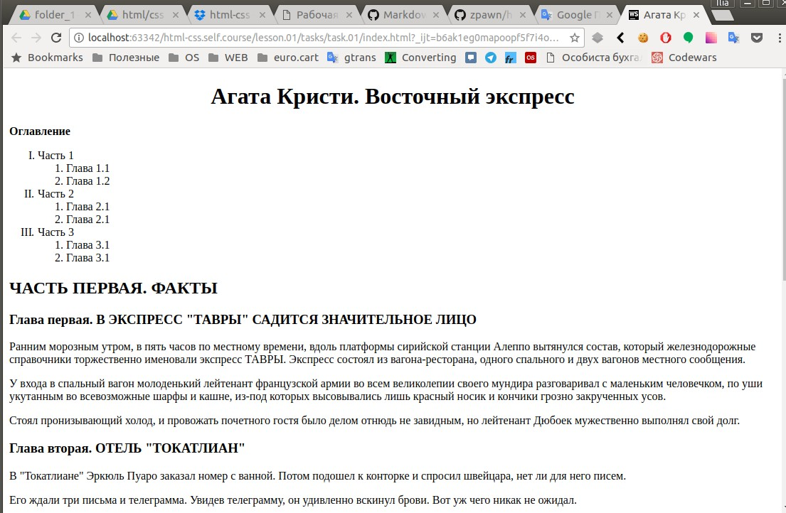
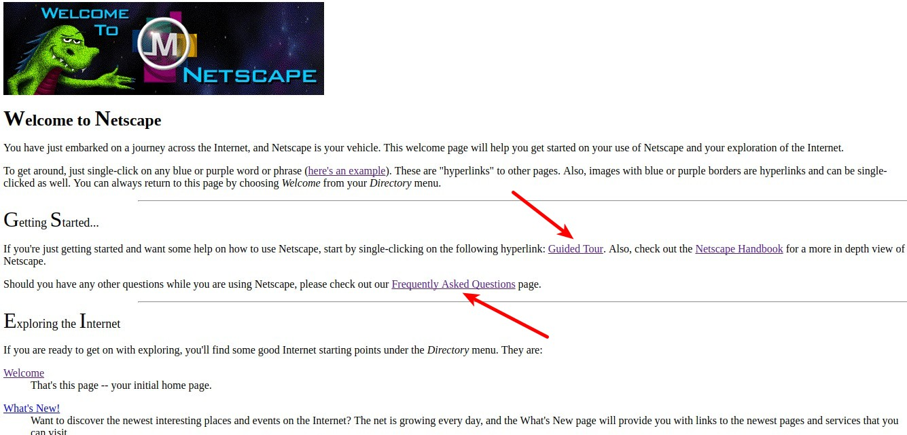

### Задание 1: 
Сверстать страничку [Листинг к заданию](task.01/info.txt)

### Задание 2: 
1. Разнести главы в отдельные файлы;
2. Сделать оглавление ссылками и залинковать их с главами;
3. В конце каждой главы сделать ссылку на оглавление.

### Задание 3:
1. Сверстать сайт [Netscape](http://home.mcom.com/home/welcome.html) образца '94г.
2. Сделать рабочими ссылки как на сайте

---
[Содержание](../../README.md)
|
[Лекция](../lecture/README.md)
