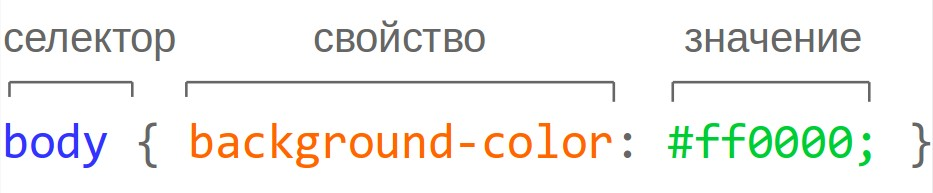

Таблицы
--------------------

`<table></table>` - контейнер для всей таблицы

`<tr></tr>` - строки

`<td></td>` - ячейки

Простая таблица
```html
<table>
    <tr>
        <td>1</td>
    </tr>
</table>
```

Объединение ячеек по горизонтали (колонок)
```html
<table>
    <tr>
        <td>1</td>
        <td>2</td>
    </tr>
    <tr>
        <td colspan="2">3</td>
    </tr>
</table>
```

Объединение ячеек по вертикали (строк)
```html
<table>
    <tr>
        <td rowspan="2">1</td>
        <td>2</td>
    </tr>
    <tr>
        <td>3</td>
    </tr>
</table>
```

CSS
-----------------------------

### Подключение
`<link rel="stylesheet" href="style.css">`

```html
<head>
    <style>
        ...
    </style>
</head>
```

```html
<p style="color: #0000ff; background-color: #8a2be2"></p>
```

### Синтаксис


`.selector { ... }` - класс

`#id { ... }` - идентификатор

`/* comments */` - комментарии

### Правила формирования селекторов

```html
<ol class="dico">
  <li>Un cobaye</li>
  <li>Des cobaux</li>
</ol>
```

Еще несколько примеров

|    Селектор    | Значение |
|      ---       | --- |
| `h1`           | ищем элементы по имени тега |
| `div.containe` | ищем `<div>` c классом container |
| `.news`        | выбираем элементы по имени класса class="news" |
| `div.news`     | все элементы `<div>` c классом «news» |
| `.wrap .post`  | ищем все элементы с классом «post» внутри элемента с классом «wrap» |
| `.cls1.cls2`   | выбираем элементы с двумя классами «class="cls1 cls2"» |
| `h1,h2,.posts` | Перечисление селекторов, выберемвсёперечисленное |

`li {...}` - Каждый `<li>`

`ol li` - Каждый `<li>` внутри предка `<ol>`

`.dico li` - Каждый `<li>` внутри предка с `class="dico"` 

### Наследование в CSS

```css
p,
ul,
ol,
li,
h1,
h2,
h3,
h4,
h5,
h6 { color: grey;}
```
or
```css
body { color: grey; }
```

### Цвет

HEX (шестнадцатеричные значения)
```css
p { color: #ff0000 }
```

Цветовую модель RGB
```css
p { color: rgb(0, 255, 0) }
```

### Единицы измерения

Наиболее часто используемые единицы:
* `px` - для пикселей;
* `%` - для процентов;

### Свойства для работы с текстом

- `font-size: 16px`
- `font-style: normal, italic`
- `font-weight: normal, bold`
- `text-align: left, right, center, justify`
- `text-decoration: overline, underline, line-through, none`
- `text-transform: none, uppercase, lowercase, capitalize`
- `color: #eeeeee`
 
### Для стилизации блоков
- `background-color: #555555`
- `background-image: url("paper.gif")`

- `border-style: solid, dotted, dashed, double, ...`
- `border-width: 2px`
- `border-color: #777777`
- `border: 1px solid #ff0000;`
- `border-radius: 10px`

#### Отступы (внешние отступы)
- `margin-top: 10px`
- `margin-right: 5px`
- `margin-bottom: 5px`
- `margin-left: 10px`
- `margin: 10px`

#### Поля  (внутренние отступы)
- `padding-top: 5px`
- `padding-right: 5px`
- `padding-bottom: 5px`
- `padding-left: 5px`
- `padding: 5px`

- `height: 100px` - высота блока
- `width: 100%` - ширина блока

### Стилизация списков
- `list-style-type: none, disc, circle, square` - для маркированного 
- `list-style-type: none, decimal, lower-alpha, upper-alpha, lower-roman, upper-roman` - для нумерованного
- `list-style-image: url('sqpurple.gif')`
- `list-style-position: inside, outside`

### Таблицы
- `border-collapse: collapse, separate`
- `vertical-align: top, middle, bottom`

---
[Содержание](../../README.md)
|
[Задания](../tasks/README.md)
