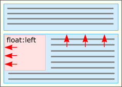

Блочная модель
--------------

### Поток


`float: left, right, none` - обтекание (выбиваем из потока)


```html
<p>
    
    ...
</p>
```


`clear: left, right, both` - отменить обтекание


Еще один пример, как можно расположить блоки, относительно друг друга


[Подробная статья про обтекания](http://softwaremaniacs.org/blog/2005/12/01/css-layout-float/)

### Видимость элемента

`visibility: hidden, visible`


`display: none`


`display: inline`


---
[Содержание](../../README.md)
|
[Задания](../tasks/README.md)
