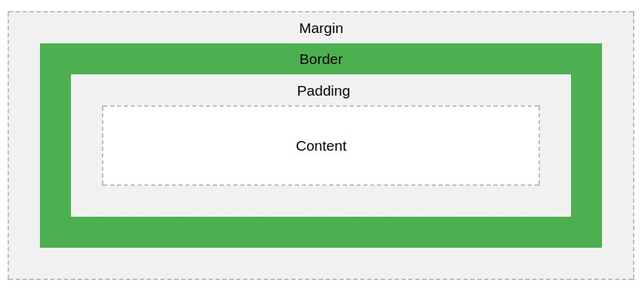
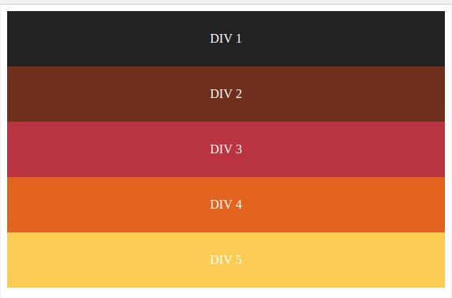
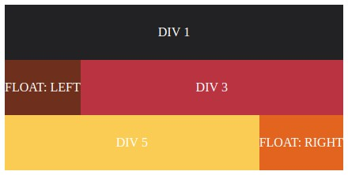
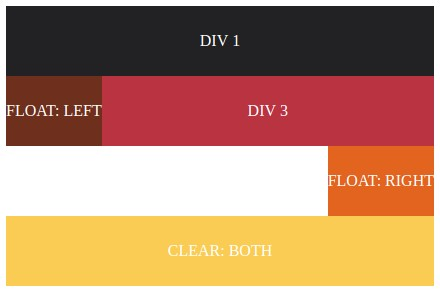
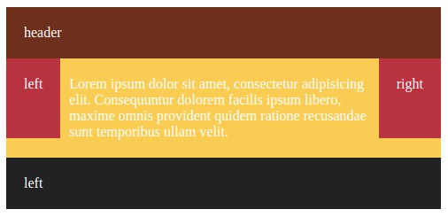
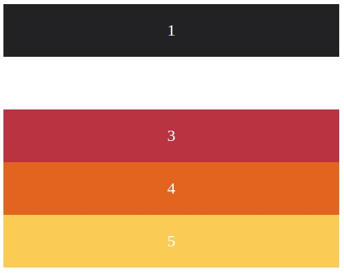
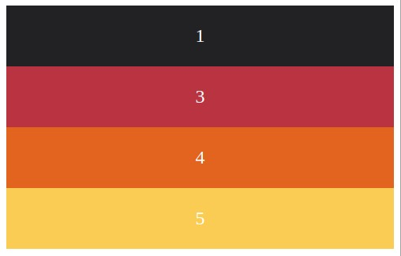
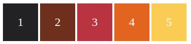

### Блочная модель

|         |            |     |
|   ---   |    ---     | --- |
| content | содержимое | здесь располагается содержимое бокса: текст и другие вложенные в него боксы|
| padding | отступы    | отступ от невидимых границ содержимого до рамки, на него, кстати, распространяется фон бокса, если он есть|
| border  | рамка      | рамка вокруг содержимого, которая, помимо декоративного эффекта, тоже влияет на размер всего бокса из-за своей толщины |
| margin  | границы    | отступы от рамки до других, внешних боксов|

width = content + (padding-left + padding-right) + (border-left + border-right) + (margin-left + margin-right)

### Поток

`float: left, right, none` - обтекание (выбиваем из потока)

`clear: left, right, both` - отменить обтекание

Еще один пример, как можно расположить блоки, относительно друг друга

[Подробная статья про обтекания](http://softwaremaniacs.org/blog/2005/12/01/css-layout-float/)

### Видимость элемента

`visibility: hidden, visible`

`display: none`

`display: inline`

---
[Содержание](../../README.md)
|
[Задания](../tasks/README.md)
