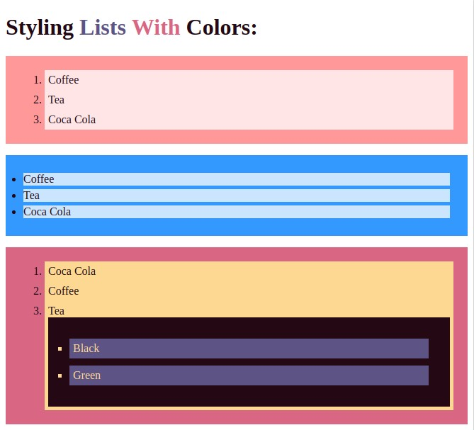
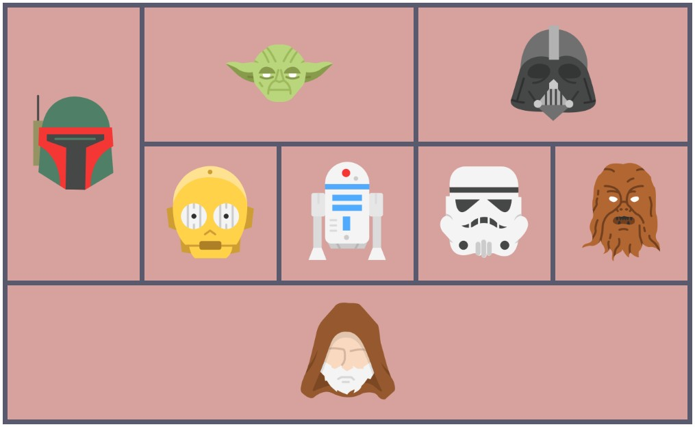

### Задание 1: 
Стилизировать списки:

1 список - `#ff9999`, `#ffe5e5`

2 список - `#3399ff`, `#ffe5e5`

3 список - `#240915`, `#5d5485`, `#d96784`, `#ed948b`, `#fdd892`

### Задание 2
Сверстать и стилизировать табличку
[картинки](task.02)

Цветовая схема: `#d7a29e`, `#595a6d`

---
[Содержание](../../README.md) |
[Лекция](../lecture/README.md)
