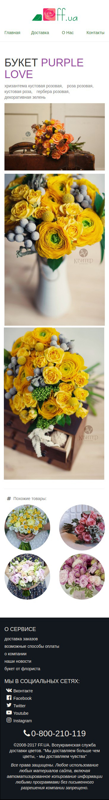

### Задание

Скачивем стили [*Bootstrap*](bootstrap.css) и подключаем в `head` самымм первым

Подключаем FontAwesome перед закрывающимся тэгом `body`
``

---
[Содержание](../../README.md)
|
[Лекция](../lecture/README.md)
