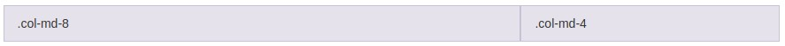

## [Twitter Bootstrap](https://getbootstrap.com/docs/3.3/css/)

### 12-ти колоночная сетка

Сетка - схема расположения всех основных блоков и элементов


### Сетка

| class        | ZAZAmarket |   FF    | для экрана |
|      ---     |    ---     |   ---   | --- |
| `.col-xs-xx` |   480px    |  320px  | phone | 
| `.col-sm-xx` |   768px    |  480px  | tablet |
| `.col-md-xx` |   1010px   |  768px  | desktop |
| `.col-lg-xx` |   1200px   |  1000px | large desktop |


```html
<div class="row">
  <div class="col-md-1">.col-md-1</div>
  <div class="col-md-1">.col-md-1</div>
  <div class="col-md-1">.col-md-1</div>
  <div class="col-md-1">.col-md-1</div>
  <div class="col-md-1">.col-md-1</div>
  <div class="col-md-1">.col-md-1</div>
  <div class="col-md-1">.col-md-1</div>
  <div class="col-md-1">.col-md-1</div>
  <div class="col-md-1">.col-md-1</div>
  <div class="col-md-1">.col-md-1</div>
  <div class="col-md-1">.col-md-1</div>
  <div class="col-md-1">.col-md-1</div>
</div>
```

```html
<div class="row">
  <div class="col-md-8">.col-md-8</div>
  <div class="col-md-4">.col-md-4</div>
</div>
```


```html
<div class="row">
  <div class="col-md-4">.col-md-4</div>
  <div class="col-md-4">.col-md-4</div>
  <div class="col-md-4">.col-md-4</div>
</div>
```


```html
<div class="row">
  <div class="col-md-6">.col-md-6</div>
  <div class="col-md-6">.col-md-6</div>
</div>
```

### Отступы


```html
<div class="row">
  <div class="col-md-4">.col-md-4</div>
  <div class="col-md-4 col-md-offset-4">.col-md-4 .col-md-offset-4</div>
</div>
```


```html
<div class="row">
  <div class="col-md-3 col-md-offset-3">.col-md-3 .col-md-offset-3</div>
  <div class="col-md-3 col-md-offset-3">.col-md-3 .col-md-offset-3</div>
</div>
```


```html
<div class="row">
  <div class="col-md-6 col-md-offset-3">.col-md-6 .col-md-offset-3</div>
</div>
```

### Прячем и показываем элементы
* `hidden-xs`, `hidden-sm`, `hidden-md`, `hidden-lg` - прячем элемент на определенном ширине экране
* `visible-xs`, `visible-sm`, `visible-md`, `visible-lg` - показываем элемент на определенной ширине экрана

### Классы для работы с текстом
* Центрирование
    * `.text-left`
    * `.text-center`
    * `.text-right`
    * `.text-justify`

* Трансформация
    * `.text-lowercase`
    * `.text-uppercase`
    * `.text-capitalize`


* Цвет
    * `.text-muted` - серый 
    * `.text-primary` - основной цвет сайта
    * `.text-success` - зеленый
    * `.text-info` - синий
    * `.text-warning` - желтый
    * `.text-danger` - красный
    
* Цвет фона
    * `.bg-primary`
    * `.bg-success`
    * `.bg-info`
    * `.bg-warning`
    * `.bg-danger`
* Обтекания
    * `.pull-left` - слева
    * `.pull-right` - справа
    * `.clearfix` - отменить с обеих сторон
* `.center-block` - центрирование блочного элемента
    
### Список

* `.list-inline` - в одну строчку
* `.list-unstyled` - не маркированный список
    
    

```html
<ul class="list-unstyled">
    <li>Facilisis in pretium nisl aliquet</li>
    <li>
        Nulla volutpat aliquam velit
        <ul>
            <li>Phasellus iaculis neque</li>
            <li>Ac tristique libero volutpat at</li>
        </ul>
    </li>
</ul>
```

### Таблицы


```html
<table class="table">
    ...
</table>
```

---


```html
<table class="table table-striped">
    ...
</table>
```

---


```html
<table class="table table-bordered">
    ...
</table>
```

### Ссылки в виде кнопок


```html
<a class="btn btn-default">Default</a>
<a class="btn btn-primary">Primary</a>
<a class="btn btn-success">Success</a>
<a class="btn btn-info">Info</a>
<a class="btn btn-warning">Warning</a>
<a class="btn btn-danger">Danger</a>
<a class="btn btn-link">Link</a>
```

### Изображения

`.img-responsive` - сделать изображение резиновым


```html


```


## [FontAwesome](http://fontawesome.io/icons/)


```html
Пример <i class="fa fa-info"></i> использования 
```


```html
<i class="fa fa-heart"></i> 
<i class="fa fa-heart fa-lg"></i> 
<i class="fa fa-heart fa-2x"></i> 
<i class="fa fa-heart fa-3x"></i> 
<i class="fa fa-heart fa-4x"></i> 
<i class="fa fa-heart fa-5x"></i> 
```


```html
<a class="btn btn-default">
    <i class="fa fa-cog fa-lg"></i> Default
</a>

<a class="btn btn-primary">
    Primary <i class="fa fa-thumbs-o-up fa-lg"></i>
</a>

<a class="btn btn-success">
    Success <i class="fa fa-hand-peace-o fa-lg"></i>
</a>

<a class="btn btn-info">
    Info <i class="fa fa-hand-scissors-o fa-lg"></i>
</a>

<a class="btn btn-warning">
    Warning <i class="fa fa fa-hand-pointer-o fa-lg"></i>
</a>

<a class="btn btn-danger">
    Danger <i class="fa fa-thumbs-o-down fa-lg"></i>
</a>

<a class="btn btn-link">
    Link <i class="fa fa-hand-spock-o fa-lg"></i>
</a>
```


```html
<ul class="fa-ul">
  <li><i class="fa-li fa fa-check-square"></i>List icons</li>
  <li><i class="fa-li fa fa-check-square"></i>can be used</li>
  <li><i class="fa-li fa fa-check text-primary"></i>as bullets</li>
  <li><i class="fa-li fa fa-check text-danger"></i>in lists</li>
  <li><i class="fa-li fa fa-check text-warning"></i>awesome</li>
</ul>
```

---
[Содержание](../../README.md) |
[Задания](../tasks/README.md)
