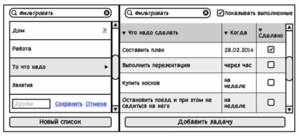

Задание ToDo Manager
---

1. Левая колонка - названия списков тудушек
2. Правый - содержимое выбранного списка тудушки
3. В левой и правой колонке при переполнении скролятся только части содержимого, но не верхние и нижние контролы.

4. Левая колонка
    * При наведении на тудушку появляется контрол удаления списка контрол редактировани. При клике на контрол список удаляется после диалога подтверждения удаления списка.
    * При клике по кнопке редактирования появляется текстовый инпут поверх названия, где можно отредактировать название теглиста. Появляются контролы "сохранить", "отмена". 
    * Поле ввода фильтровать при заполнении, список ниже показывает только те теглисты, имена которых соответствуют введенному тексту. 
    * Выбранный теглист подсвечивается. 
    * При клике по "Новый список" добавляется элемент в левую колонку, выгляди точно так же, как и редактируемый (сохранить, отмена), только без введенного имени.
5. Правая колонка
    * Фильтр в верху
    * Опция отображения-скрытия завершенных задач
    * Список дел. Колонки сортируемы, заголовки видны всегда
    * При клике по клетке "когда" одной задачи показывать какой-нить выбор даты (найти плагин более подходящий под эту задачу).
    * При создании новой задачи никакой даты не выбрано. Задачу можно редактировать так же, как и названия списка задач.
